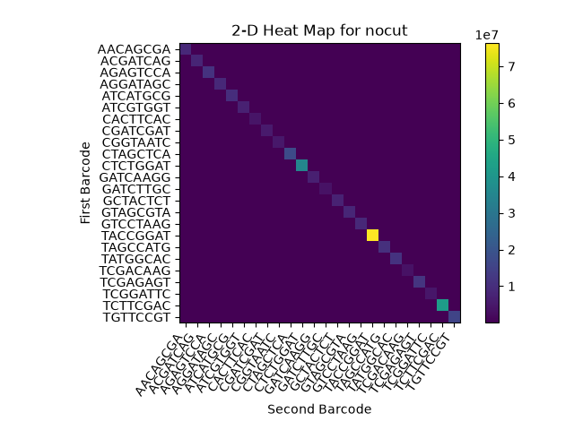
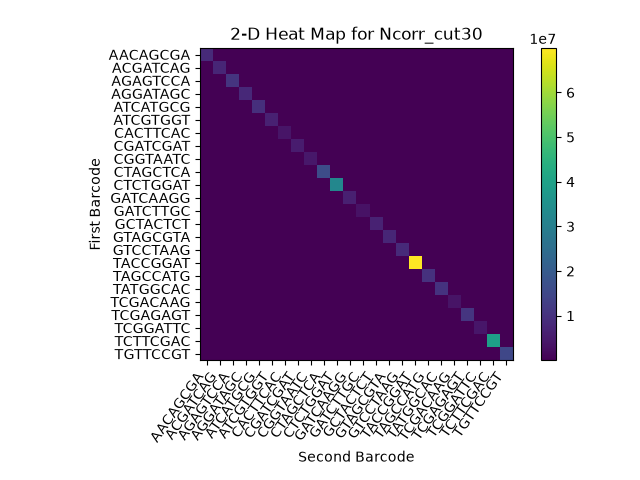
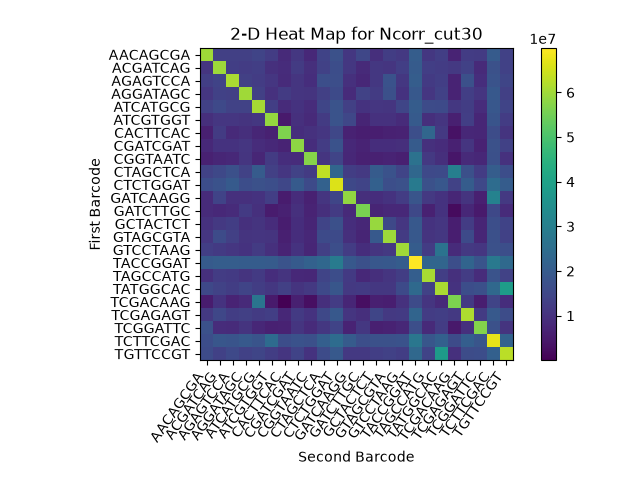
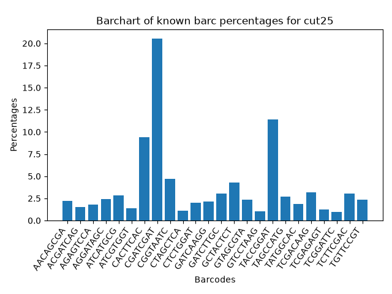
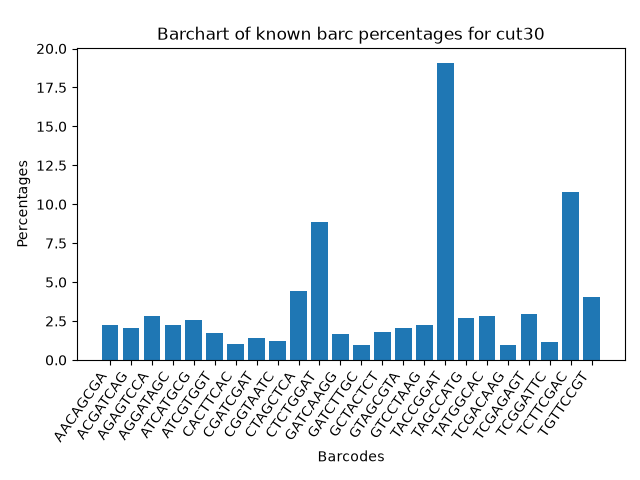
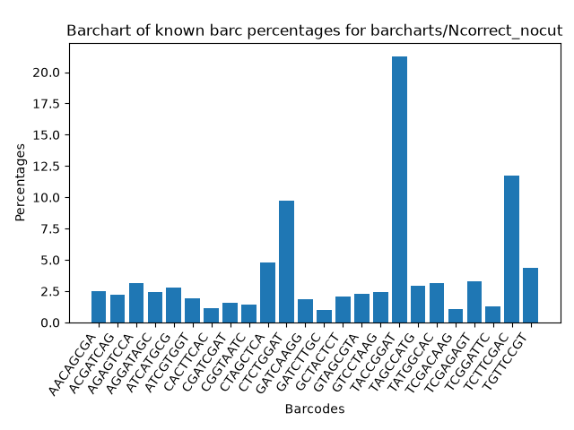
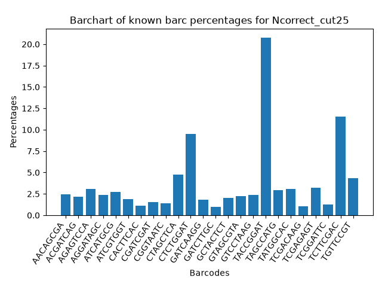

 # Demultiplexing Python Script 

 ## Two versions

 To versions of the demultiplexing program were made. 

 [No N correction python script](demultiplex.py)   
 [N correction python script](demultiplex_Ncorrections.py)
 
 - One sends all entries with barcode that contain any Ns to unknown. 
 - The other categorizes barcodes with 2 or fewer Ns (3 or more N's get sent to unknown)
    - It will match the N barcode to a barcode from known barcodes 
    - if it does not match, it is unk
    - if it does match and they are reverse compliment, it is known 
    - if they both match but are not reverse compliment, it is hopped 

Both programs take the same flags. 

## Flags 

If you run without any flags, the program will output the following: 
```bash 
[hankap@login3 Assignment-the-third]$ ./demultiplex.py 
usage: demultiplex.py [-h] -R1 R1 -R2 R2 -R3 R3 -R4 R4 -o OUTPATH -k KNOWNBARCS [-c PHREDCUTOFF] -f OUTFILENAME
demultiplex.py: error: the following arguments are required: -R1/--R1, -R2/--R2, -R3/--R3, -R4/--R4, -o/--outpath, -k/--knownbarcs, -f/--outfilename

```

If you run with -h: 

```bash 
[hankap@login3 Assignment-the-third]$ ./demultiplex.py -h 
usage: demultiplex.py [-h] -R1 R1 -R2 R2 -R3 R3 -R4 R4 -o OUTPATH -k KNOWNBARCS [-c PHREDCUTOFF] -f OUTFILENAME

A program to demultiplex 4 illumina sequencing files

options:
  -h, --help            show this help message and exit
  -R1, --R1 R1          R1 file path
  -R2, --R2 R2          R2 file path
  -R3, --R3 R3          R3 file path
  -R4, --R4 R4          R4 file path
  -o, --outpath OUTPATH
                        path to output dir where subfolder will be created, with NO '/' at the end
  -k, --knownbarcs KNOWNBARCS
                        path to known barcodes tsv with format of 'A12 TCGACAAG' on each line
  -c, --phredcutoff PHREDCUTOFF
                        int indicated minimum average phred score for barcodes
  -f, --outfilename OUTFILENAME
                        name of stats file
```

- the R1, R2, R3, and R4 flags are for the four file paths to the sequence and barcode files 
- the -o flag is for the output directory path 
- the -k flag is for the path to the known barcodes tsv file 
- the -c flag is for the desired phred cutoff (default is 25, not a required flag). The programs will check if the quality score is LESS THAN the provided argument. It is inclusive of the passed qual score cutoff. 
- the -f flag is for the desired output stats file name. This will contain stats like totals and percentages. 

## Runs performed 

each of the two versions were run 3 times. 

[nocut sbatch](bash_scripts/python_run_nocut.sh)  
[cut25 sbatch](bash_scripts/python_run.sh)  
[cut30 sbatch](bash_scripts/python_run_cut30.sh)   
[Ncorrected nocut sbatch](bash_scripts/python_run_Ncorrect_nocut.sh)  
[Ncorrected cut25 sbatch](bash_scripts/python_run_Ncorrect.sh)  
[Ncorrected cut30 sbatch](bash_scripts/python_run_Ncorrect_cut30.sh) 

for both N correction and no N correction, the following were run: 

- no cutoff (-500 cutoff, includes all reads)
- 25 cutoff (default if no cutoff passed)
- 30 cutoff 

## Slurm.out files
[slurm.out files](slurm.out_finalruns)

All runs were timed. Each run took about 1 hour on average. 

## Stat files

a total of 6 stat files were generated: 

[cut25 txt](stats_txt_files/stats_demultiplex.txt)  
[cut30 txt](stats_txt_files/stats_demultiplex_30.txt)    
[nocut txt](stats_txt_files/stats_demultiplex_nocut.txt)    


[Ncorrected_cut25 txt](stats_txt_files/stats_demultiplex_Ncorrect.txt)    
[Ncorrected_cut30 txt](stats_txt_files/stats_demultiplex_Ncorrect_30.txt)    
[Ncorrected_nocut txt](stats_txt_files/stats_demultiplex_Ncorrect_nocut.txt)  

stats head for nocut: 
```
total num records: 363246735
known barcode records: 331755033
hopped barcode records: 707740
unknown barcode records: 30783962
```

stats tail for nocut: 
```
percentage of GTAGCGTA reads: 2.235186780137198%
percentage of CGATCGAT reads: 1.5430189620286607%
percentage of GATCAAGG reads: 1.81339551475941%
percentage of AACAGCGA reads: 2.4424263579409735%
percentage of TAGCCATG reads: 2.926284526686799%
percentage of CGGTAATC reads: 1.394343159065146%
percentage of CTCTGGAT reads: 9.628823504772864%
percentage of TACCGGAT reads: 21.022585929093072%
percentage of CTAGCTCA reads: 4.771422377684964%
percentage of CACTTCAC reads: 1.1538680450906187%
percentage of GCTACTCT reads: 2.041740856941219%
percentage of ACGATCAG reads: 2.186627499900309%
percentage of TATGGCAC reads: 3.0789826644966265%
percentage of TGTTCCGT reads: 4.331217732762278%
percentage of GTCCTAAG reads: 2.430930590470414%
percentage of TCGACAAG reads: 1.060807883104579%
percentage of TCTTCGAC reads: 11.58829741442824%
percentage of ATCATGCG reads: 2.7770388631297678%
percentage of ATCGTGGT reads: 1.8961194516999582%
percentage of TCGAGAGT reads: 3.2323888609762728%
percentage of TCGGATTC reads: 1.269481472421218%
percentage of GATCTTGC reads: 1.0023688168869571%
percentage of AGAGTCCA reads: 3.1154526413017862%
percentage of AGGATAGC reads: 2.387682851437054%
```

## Visualizing with heatmaps

heatmaps were generated using matplotlib imshow.
both normal and logarithmic scaled were graphed. 

[visualizing python script](visualizing.py)

  
  
  
  
  



   
   
   
   
   


All heatmaps look generally the same regardless of cutoff or N correction. 

## Barchart generation 

barcharts were generated using matplotlib bar.
These are barcharts showing the percentage of matched barcodes per each of the 24 out of the total number of barcodes observed. 

[barcharts python script](barchart.py)

  
  
  
  
  


All barcharts look generally the same regardless of cutoff or N correction.

## Comparing N correction vs Non-N correction

For this comparison I will only consider the no cutoff runs. 

for non-N correction: 
```
total num records: 363246735
known barcode records: 331755033
hopped barcode records: 707740
unknown barcode records: 30783962
```

for N correction: 
```
total num records: 363246735
known barcode records: 335574850
hopped barcode records: 716398
unknown barcode records: 26955487
```

The N correction was able to recover many barcodes that were previously unknown: 
```
matched for N - matched for non-N = 
335574850 - 331755033 = 
3819817 barcodes saved!

```
over 3.5 million matched barcodes were recovered through N correcting.


